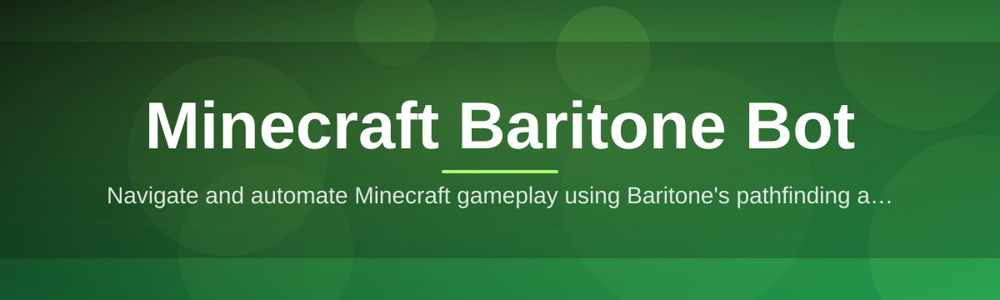
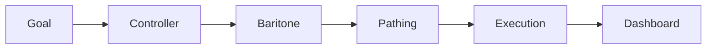

# minecraft-baritone-controller 🧭⛏️

  

*A control panel for Baritone pathfinding that finally treats your time as a finite resource.*

---

## 🪨 Overview

Let's be honest: vanilla Minecraft movement is a chore. You want to strip-mine a canyon, build a highway from spawn to your base, or farm cobblestone for the eleventh hour in a row — and instead you're the one holding W for forty-five minutes like it's 2011. **minecraft-baritone-controller** is a standalone Windows desktop companion that wraps the legendary Baritone pathfinding engine in an actual interface, so you stop memorizing chat commands and start clicking buttons like a civilized person.

This project exists because Baritone is genuinely one of the smartest pieces of engineering in the Minecraft ecosystem — A* pathing, block-aware terrain analysis, goal-based navigation — but its default UX is "type cryptic commands into chat and hope." We built a controller layer on top that exposes mining goals, travel routes, building queues, and farming loops through a real GUI, with live telemetry so you can actually see what your bot is thinking instead of squinting at scrolling chat text.

Who's this for? Builders tired of manual travel, miners who'd rather queue up a strip-mine and go make coffee, redstone engineers who need a reliable mule to fetch materials, and server admins who want a predictable, inspectable automation layer instead of a black box. If you've ever typed `#goal` and immediately forgotten the syntax, this tool was built with your specific frustration in mind.

  

> [!TIP]
> New here? Skip to **⚡ Three Steps and You're Wandering** below — the whole setup takes less time than reading this sentence twice.

---

## ⚡ Three Steps and You're Wandering

Before we get into the weeds, here's the entire onboarding flow. Yes, it's really this short.

1. **Grab the build** from the download button above — one landing page, one download, zero mystery mirrors.

2. **Launch the controller** on your Windows machine — no dependency chasing, no runtime installers, no "please install .NET Framework 3.5" nonsense.

3. **Point it at your client and hit Connect** — set a goal (mine, travel, farm, build), press start, and watch your bot get to work while you do literally anything else.

That's it. Everything past this point is context, polish, and the stuff you'll want once you're hooked.

---

## 🧠 What It Actually Does

  

| Capability | The Fresh Angle |
|---|---|
| **Goal-based pathfinding dashboard** | Set a destination on a live map instead of guessing coordinates from a screenshot. |
| **Automated strip-mine orchestration** | Queue mining lanes with depth, width, and Y-level constraints — the bot does the boring geometry. |
| **Smart resource-aware farming loops** | Detects crop maturity and loot chests, cycling harvest routes without babysitting. |
| **Live pathing visualizer** | Watch the A* route render in real time so you actually understand *why* the bot turned left. |
| **Anti-stuck recovery logic** | Detects when the bot is wedged in a hole or lava-adjacent and self-corrects before disaster. |
| **Building queue with block-priority sorting** | Feed it a schematic-style plan and it places blocks in the smartest order, not a random one. |
| **Session telemetry & replay log** | Every run is logged — inventory deltas, distance traveled, time saved — for the data nerds among us. |
| **Multi-profile presets** | Save "Miner," "Courier," "Farmer," and "Builder" profiles and swap between them in one click. |

> [!NOTE]
> This isn't a magic autopilot that plays the whole game for you. It's a precision tool for the repetitive 80% so you can focus on the creative 20%.

---

## 🚀 How to Get Started

<strong>Click to expand the full walkthrough</strong>

1. Visit the landing page via the download button and grab the latest Windows build.

2. Run the executable — it's a standalone binary, so there's nothing else to unpack or configure first.

3. Open the controller, connect it to your running Minecraft client, and select a preset (Miner, Courier, Farmer, Builder) or build a custom goal.

4. Hit **Start**, watch the live pathing visualizer, and adjust on the fly using the in-app control panel.

> [!IMPORTANT]
> Always run the controller on a client and server setup where automation is welcome. Respect the rules of whatever world you're playing in — this tool is an assistant, not a permission slip.

---

## 🖥️ System Requirements

| Requirement | Detail |
|---|---|
| **OS** | Windows 10 or Windows 11 (64-bit) |
| **Dependencies** | None — fully standalone, nothing extra to install |
| **Minecraft Edition** | Java Edition, compatible with modern releases |
| **Disk Space** | Under 200 MB |
| **RAM** | 4 GB minimum, 8 GB recommended for large mining queues |
| **Network** | Local connection to your running game client |

---

## 🔩 How It Works

The architecture is deliberately simple — a thin, transparent layer between you and the pathfinding brain, not a tangle of hidden services.

1. **You define a goal** — travel, mine, farm, or build — through the controller UI.

2. **The controller translates that goal** into structured pathing instructions the Baritone engine understands.

3. **Baritone computes the route** using its A* terrain-aware search across the loaded chunks.

4. **The bot executes movement and actions**, streaming live status back to your dashboard.

5. **You monitor, pause, or redirect** at any point — nothing runs in a sealed box.

---

## 🧯 Troubleshooting

**Q: The bot keeps stopping at the same block and refuses to continue.**
A: That's almost always a broken path — a missing block, unbreakable barrier, or a loaded-chunk edge. Toggle "force break" in settings or re-issue the goal after moving closer.

**Q: My mining queue finished way faster than expected and I'm suspicious.**
A: Check your Y-level constraints — if the range was narrow, the bot legitimately just finished quickly. Efficiency isn't a bug.

**Q: The live pathing visualizer is blank.**
A: Confirm the controller is actually connected to the client (check the connection indicator, top-right). A dropped connection is the #1 cause.

**Q: The bot walked into lava. Why didn't anti-stuck logic save it?**
A: Anti-stuck recovery handles *being wedged*, not *terrain hazard avoidance in real time* — those are separate systems. File an issue with your seed/coordinates if it happened on safe terrain.

**Q: Building queue placed blocks in a weird order.**
A: Block-priority sorting optimizes for structural support first, not visual sequence. It looks odd mid-build but resolves correctly at completion.

**Q: Can I run multiple profiles at once?**
A: Not simultaneously on one client — pick one active profile per session, but you can queue profile switches back to back.

---

## 🎛️ UI / UX Details

> [!TIP]
> The whole interface is keyboard-navigable — mouse optional once you know the shortcuts.

| Shortcut | Action |
|---|---|
| `Ctrl + G` | Open Goal Setter |
| `Ctrl + S` | Start / Resume active task |
| `Ctrl + P` | Pause current task |
| `Ctrl + L` | Toggle live pathing visualizer |
| `Ctrl + R` | Open session replay log |
| `F1` | Quick-swap profile preset |

- Themes: **Midnight** (default dark), **Parchment** (light), and **Redstone** (high-contrast accent mode).

- Settings panel groups controls into *Pathing*, *Safety*, *Automation*, and *Telemetry* tabs — nothing buried three menus deep.

- Status bar always shows connection health, current goal, and elapsed time, because ambiguity is the enemy of trust.

---

## 🤝 Contributing & Community

We treat this like real infrastructure, not a weekend toy — issues get triaged, PRs get reviewed, and roadmap decisions happen in the open.

> [!WARNING]
> Please don't open issues asking how to use automation to violate a specific server's rules. We build tools for legitimate automation and productivity — how you deploy that is on you.

- Found a bug? Open an issue with your build version, OS build number, and reproduction steps.

- Want a feature? Check open discussions first — chances are someone already pitched it, and your +1 matters more than a duplicate thread.

- Pull requests are welcome; keep changes focused, documented, and tested against a live client before submitting.

---

## 📜 License

Released under the [MIT License](LICENSE), 2026. Use it, fork it, build on it — just keep the license notice intact.

---

## ⚠️ Disclaimer

This project is an independent community tool and is not affiliated with, endorsed by, or associated with Mojang, Microsoft, or the official Baritone maintainers. Automation behavior can vary by Minecraft version, server configuration, and world state — always test in a controlled environment first, and respect the terms of service of whatever server or realm you play on.

  

